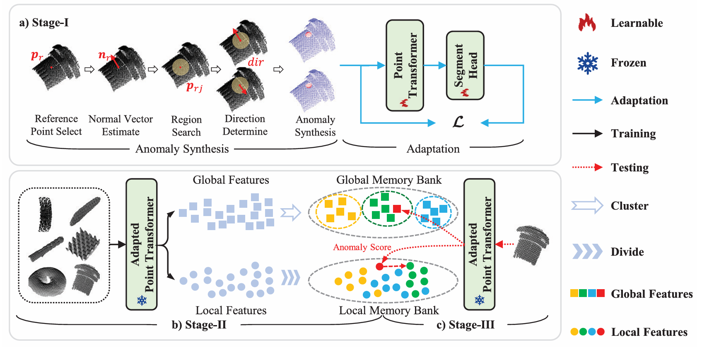

# GLFM-Multi-class-3DAD

> [**IEEE TASE**] [**Boosting Global-Local Feature Matching via Anomaly Synthesis for Multi-Class Point Cloud Anomaly Detection**](https://export.arxiv.org/abs/2409.13162).
>
> by [Yuqi Cheng](https://hustcyq.github.io/), [Yunkang Cao](https://caoyunkang.github.io/), Dongfang Wang, [Weiming Shen](https://scholar.google.com/citations?user=FuSHsx4AAAAJ&hl=en), Wenlong Li

:hammer: Thank you for your attention! Our code is expected to be released in May.

## Introduction 
Point cloud anomaly detection is essential for various industrial applications. The huge computation and storage costs caused by the increasing product classes limit the application of single-class unsupervised methods, necessitating the development of multi-class unsupervised methods. However, the feature similarity between normal and anomalous points from different class data leads to the feature confusion problem, which greatly hinders the performance of multi-class methods. Therefore, we introduce a multi-class point cloud anomaly detection method, named GLFM, leveraging global-local feature matching to progressively separate data that are prone to confusion across multiple classes. Specifically, GLFM is structured into three stages: Stage-I proposes an anomaly synthesis pipeline that stretches point clouds to create abundant anomaly data that are utilized to adapt the point cloud feature extractor for better feature representation. Stage-II establishes the global and local memory banks according to the global and local feature distributions of all the training data, weakening the impact of feature confusion on the establishment of the memory bank. Stage-III implements anomaly detection of test data leveraging its feature distance from global and local memory banks. Extensive experiments on the MVTec 3D-AD, Real3D-AD and actual industry parts dataset showcase our proposed GLFM’s superior point cloud anomaly detection performance.

## Overview of GLFM



## 🛠️ Getting Started

### Installation
To set up the GLFM environment, follow the methods below:

- Clone this repo:
  ```shell
  git clone https://github.com/hustCYQ/GLFM.git && cd GLFM
  ```
- Construct the experimental environment, follow these steps:
    ```shell
  conda create --name GLFM python=3.8
  conda activate GLFM
  pip install -r requirements.txt
  
  pip install --upgrade https://github.com/unlimblue/KNN_CUDA/releases/download/0.2/KNN_CUDA-0.2-py3-none-any.whl

  git clone https://github.com/erikwijmans/Pointnet2_PyTorch.git
  cd Pointnet2_PyTorch
  pip install -r requirements.txt
  pip install -e .
  cd ..
  ```


### Dataset Preparation 
Welcome to directly download our **processed** datasets. All datasets need to be placed in your `DATA_ROOT`.

| Dataset | Google Drive | Baidu Drive | Note
|------------|------------------|------------------| ------------------|
| MVTec 3D-AD    | [Google Drive] | [Baidu Drive]() | Remove Background |
| Real3D-AD    | [Google Drive] | [Baidu Drive]() | Cut Training Data |


### Self-Supervised
```shell
  python train.py
  ```


### Train & Test

```
  python main.py --dataset mvtec --task Single-Class --k_class 1
  python main.py --dataset real --task Single-Class --k_class 1
  python main.py --dataset mvtec --task Multi-Class --k_class 10
  python main.py --dataset real --task Multi-Class --k_class 3
```


## Main Results
### Multi-Class Task


### Single-Class Task


### Train & Test
If you find this repository useful for your research, please use the following.

```
@ARTICLE{GLFM,
  author={Cheng, Yuqi and Cao, Yunkang and Wang, Dongfang and Shen, Weiming and Li, Wenlong},
  journal={IEEE Transactions on Automation Science and Engineering}, 
  title={Boosting Global-Local Feature Matching via Anomaly Synthesis for Multi-Class Point Cloud Anomaly Detection}, 
  year={2025},
  volume={22},
  number={},
  pages={12560-12571},
  keywords={Feature extraction;Point cloud compression;Anomaly detection;Data models;Training;Image reconstruction;Computational modeling;Automation;Self-supervised learning;Pipelines;Anomaly detection;point cloud;multi-class;global-local feature matching;anomaly synthesis},
  doi={10.1109/TASE.2025.3544462}}
```


## Acknowledgments
- This work was supported in part by the Ministry of Industry and Information Technology of the People’s Republic of China under Grant 2023ZY01089 and
 in part by the Fundamental Research Funds for the Central Universities of  China under Grant HUST: 2021GCRC058.

- Our code implementation is based on [3D-ADS](https://github.com/eliahuhorwitz/3D-ADS) and [M3DM](https://github.com/nomewang/M3DM), thanks for your good jobs.
